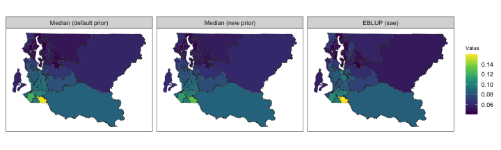
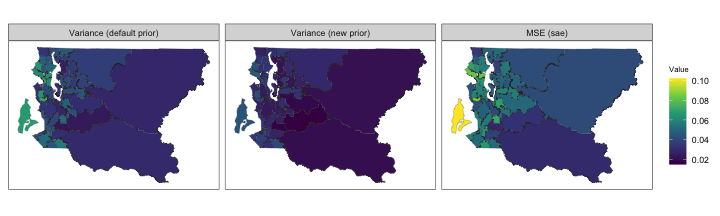
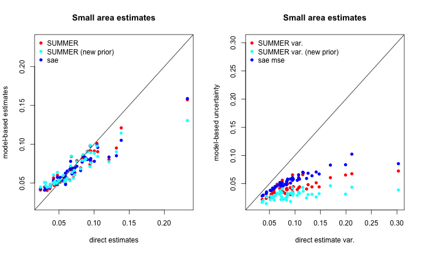
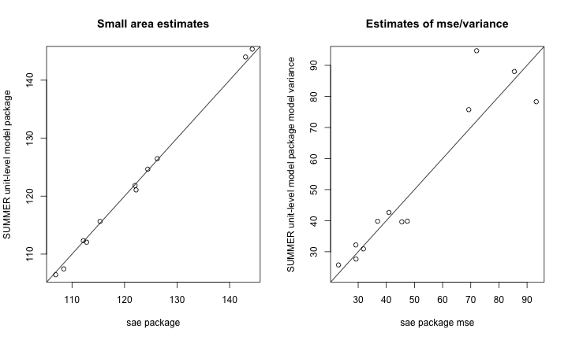

In this vignette, we illustrate the use of the `smoothArea` and `smoothUnit` functions for generic small area estimation of outcomes other than under-five mortality rates. Using example data presented in the `sae` vignette, we compare our results from `SUMMER` with those obtained using the `sae` package (for a survey of other packages for small area estimation, see @kreutzmann2019).

# Preliminary

First, we load the necessary packages and data. The required package `INLA` is not available via a standard repository, so we include code for installation if it is not found. The `survey` package will be used to generate direct estimates, while `dplyr` and `tidyr` will be used for data manipulation.


```r
library(sae)
library(SUMMER)
library(survey)
library(dplyr)
library(tidyr)
library(sf)
library(ggplot2)
if (!isTRUE(requireNamespace("INLA", quietly = TRUE))) {
  install.packages("INLA", repos=c(getOption("repos"), 
                  INLA="https://inla.r-inla-download.org/R/stable"), dep=TRUE)
}
```

# Area level models

## Artificial poverty rate example

In their vignette for the `sae` package, @molina2015 generate an artificial dataset on income and other related variables to illustrate the use of area level models. In this example, the objective is to estimate prevalence of poverty in Spanish counties.


```r
data("incomedata")
data("sizeprov")
data("sizeprovedu")
povertyline <- 0.6 * median(incomedata$income) # 6557.143
incomedata$in_poverty <- as.integer(incomedata$income < povertyline)
```

The `incomedata` data frame contains information on 17199 observations of individuals in 52 Spanish provinces. Income values and sampling weights are provided for each individual along with covariate information including age group and education level. @molina2015 define the poverty line and calculate an indicator variable (which we name `in_poverty`) with value 1 if the corresponding income value is below the poverty line and 0 otherwise.

### Direct estimation with `sae`

Before considering model-based methods for small area estimation, we compute direct weighted estimators for the desired small area means. The `sae::direct` function computes the Horvitz-Thompson estimator of domain means given by

$$
\widehat{\overline{Y}}_{i}^{\text{DIR}}=\frac{1}{N_i}\sum_{j\in S_i}w_{j}y_{j}
$$

where $N_i$ is the population size of domain $i$, $S_i$ is the set of sampled observations in domain $i$, $w_{j}$ is the sampling weight for unit $j$, and $y_{j}$ is the observation for unit $j$, for all $j \in S_i$. The `sae::direct` function also estimates standard deviation and coefficient of variation for each domain. Note that $N_i$ is assumed known and is provided in the data frame `sizeprov`. The domains of interest are identified via the `provlab` variable.


```r
Popn <- sizeprov[, c("provlab", "Nd")]
sae.DIR <- sae::direct(y = incomedata$in_poverty, dom = incomedata$provlab,
                       sweight = incomedata$weight, domsize = Popn) |>
  select(Domain, Direct, SD)
```

### Direct estimation with `survey`

We can similarly use the `survey::svyby` function to compute the Horvitz-Thompson estimates:


```r
incomedata$pop <- sum(sizeprov$Nd[match(incomedata$provlab, sizeprov$provlab)])
design <- survey::svydesign(ids = ~1, weights = ~weight,
                            data = incomedata, fpc = ~pop)

# estimate area totals
svy.DIR <- survey::svyby(~in_poverty, ~provlab, design, svytotal)

# calculate corresponding area mean estimates
svy.DIR$prov_pop <- sizeprov$Nd[match(svy.DIR$provlab, sizeprov$provlab)]
svy.DIR$Domain <-svy.DIR$provlab 
svy.DIR$Direct = svy.DIR$in_poverty/svy.DIR$prov_pop
svy.DIR$SD= svy.DIR$se/svy.DIR$prov_pop
```

### Basic area level model

The basic area level model, also called the Fay-Herriot model, treats direct estimates of small area quantities as response data and explicitly models differences between areas using covariate information and random effects @fay1979. The Fay-Herriot model can be viewed as a two-stage model: in the first stage, a *sampling model* represents the sampling variability of a direct estimator and in the second stage, a *linking model* describes the between area differences in small area quantities.

**Sampling model**:

Let $\widehat\theta^{\text{DIR}}_i$ be a direct estimator of an area level mean or total $\theta_i$. The sampling model treats $\widehat\theta^{\text{DIR}}_i$ as a noisy observation of the true finite population quantity $\theta_i$:

$$
\widehat\theta^{\text{DIR}}_i=\theta_i+\epsilon_i;\hspace{2em}\epsilon_i\sim_{ind}N(0,V_i),\hspace{2em}i=1,\ldots, M
$$

where $V_i$ is the **known sampling variance** of the direct estimator $\widehat{\theta}^{\text{DIR}}_i$.

**Linking model**:

$$
\theta_i = \textbf{x}_i^T\boldsymbol\beta+u_i,\hspace{2em}u_i\sim_{ind}N(0,\sigma_u^2)\hspace{2em}i=1,\ldots, M,
$$

where $\sigma_u^2$ (between-area residual variance) is estimated. In this basic Fay-Herriot model, the area-specific random effects $u_i$ are assumed to be independent and identically distributed (IID) between areas.

Below, we provide a quantile-quantile plot comparing the direct estimates to a Gaussian distribution. Here the observed quantiles align well with those from a Gaussian distribution, which lends some support to the basic IID model.


```r
par(pty = "s")
mu.DIR <- mean(sae.DIR$Direct)
sd.DIR <- sd(sae.DIR$Direct)
qqnorm((sae.DIR$Direct - mu.DIR) / sd.DIR, main = "")
abline(0, 1, col = "red")
```


### Area level modeling with `sae`

As described by @molina2015, the `sae::mseFH` function fits the basic area level model (via REML by default) and calculates the empirical best linear unbiased predictors (EBLUP) for all domain means as well as their estimated MSEs. 


```r
sae.FH <- sae::mseFH(sae.DIR$Direct~1, sae.DIR$SD^2)
sae.FH.table <- data.frame(
  Domain = sae.DIR$Domain,
  EBLUP = sae.FH$est$eblup,
  RMSE = sqrt(sae.FH$mse)
)
head(sae.FH.table)
##     Domain      EBLUP       RMSE
## 1    Alava 0.23407448 0.03836098
## 2 Albacete 0.15335213 0.02744856
## 3 Alicante 0.20511853 0.02051886
## 4  Almeria 0.24498009 0.03427432
## 5    Avila 0.07797403 0.02372809
## 6  Badajoz 0.20928033 0.02186672
```

### Area level modeling with `SUMMER`

The `SUMMER` package adopts a Bayesian approach to inference using models such as the basic area level model, carrying out computation via the `INLA` package. The `smoothArea` function computes direct estimates and then produces smoothed estimates using a Bayesian Fay-Herriot model. The main arguments of interest are:

-   `formula`: Describing the response variable and any area-level covariates
-   `domain` A one-sided formula with the variable containing domain labels on the right. The domain labels variable should be contained in the dataset used to generate the design.
-   `design`: A `survey.design` object containing survey data and specifying the survey design.

In addition, other commonly used optional arguments include:

-   `adj.mat`: Optional adjacency matrix if a spatial smoothing model is desired.
-   `transform`: If `"logit"` is specified, a logit transform will be applied to the direct estimates and an appropriate transformation will be applied to the estimated sampling variances before smoothing.
-   `direct.est`: The direct estimates may be specified directly and smoothing will be applied directly to these user-provided estimates.
-   `X.domain`: Data frame of area level covariates.
-   `domain.size`: Data frame of domain sizes used for computing direct estimates if domain sizes are known.

Other optional arguments can be specified to change the priors and are described further in the documentation.

For the artificial poverty rate example, we fit the Fay-Herriot model and obtain the following smoothed estimates.


```r
# specify known domain sizes
domain.size <- sizeprov[, c("provlab", "Nd")]
colnames(domain.size)[2] <- "size"

# fit model and obtain svysae object
summer.FH <- smoothArea(formula = in_poverty~1,
                        domain = ~provlab,
                        design = design,
                        domain.size = domain.size, 
                        return.samples = T)
## Warning in smoothArea(formula = in_poverty ~ 1, domain = ~provlab, design =
## design, : Direct estimates appear to be proportions. You may want to consider
## using transform = 'logit'.

summer.FH.table <- data.frame(
  Domain = sae.DIR$Domain,
  Median = summer.FH$iid.model.est$median,
  SE = sqrt(summer.FH$iid.model.est$var)
)
head(summer.FH.table)
##     Domain     Median         SE
## 1    Alava 0.23449184 0.03704801
## 2 Albacete 0.15383656 0.02760217
## 3 Alicante 0.20385758 0.02104621
## 4  Almeria 0.24485689 0.03331238
## 5    Avila 0.07516739 0.02379961
## 6  Badajoz 0.20959769 0.02128758
```


The fitted parameters from `sae` (obtained via likelihood-based methods) and estimated parameter posterior distribution from `SUMMER` (obtained from Bayesian methods, implemented via `INLA`) are in reasonable agreement. The estimated intercept $\beta_0$ from `sae` is 0.202 ; the posterior median of $\beta_0$ from `SUMMER` is 0.202. In the absence of strong priors, fixed effects are usually in close agreement, with the posterior being symmetric. The estimated precision $1/\sigma_u^2$ from `sae` is 281.34787 , while the posterior median of $1/\sigma_u^2$ from `SUMMER` is 273.241562. The differences are larger here, but the posterior for the variance is skewed, and we would expect the posterior median to be smaller than the REML estimate. The area estimates and measures of uncertainty are in close agreement, however.

We first illustrate the shrinkage of the EBLUP estimates, and the reduced uncertainty:


```r
par(mfrow = c(1, 2))
plot(sae.DIR$Direct, sae.FH$est$eblup,
     xlab = "Direct estimates",ylab = "sae package",
     xlim=c(min(sae.DIR$Direct, sae.FH$est$eblup),max(sae.DIR$Direct, sae.FH$est$eblup)),
     ylim=c(min(sae.DIR$Direct, sae.FH$est$eblup),max(sae.DIR$Direct, sae.FH$est$eblup)),
     main = "Small area estimates")
abline(0,1,col="red")
plot(sae.DIR$SD^2, sae.FH$mse,
     xlab = "Direct estimates",ylab = "sae package",
     xlim=c(min(sae.DIR$SD^2, sae.FH$mse),max(sae.DIR$SD^2, sae.FH$mse)),
     ylim=c(min(sae.DIR$SD^2, sae.FH$mse),max(sae.DIR$SD^2, sae.FH$mse)),
     main = "Estimates of uncertainty")
abline(0,1,col="red")
```


Now compare EBLUP and HB, using posterior variance from `SUMMER` and estimated MSE from `sae` to measure uncertainty:


```r
par(mfrow = c(1, 2))
plot(sae.FH$est$eblup, summer.FH$iid.model.est$median,
     xlab = "sae package",ylab = "SUMMER package",
     main = "Small area estimates")
abline(0,1,col="red")
plot(sae.FH$mse,
     summer.FH$iid.model.est$var, 
     xlab = "sae package mse",
     ylab = "SUMMER package model variance",
     main = "Estimates of mse/variance")
abline(0,1,col="red")
```


The `SUMMER` package includes functions to generate additional diagnostic plots based on samples from the model posterior. The `compareEstimates()` function generates a heatmap of the posterior pairwise probabilities of one area's mean exceeding another's mean.


When geographic polygon data for each domain is available as a shapefile, the `sf` package can be used to load this data in R. The `mapEstimates()` function can then be used to provide a summary map of posterior medians or posterior variances.


## Spatial Fay-Herriot

The `sae` package also provides tools for implementing a spatial version of the Fay-Herriot model which assumes that the vector of area specific effects follows a first order simultaneous autoregressive, or SAR(1), process: $$\textbf{u}=\rho_1\textbf{Wu}+\boldsymbol\epsilon,\hspace{1em}\boldsymbol\epsilon\sim N(\textbf{0}_i,\sigma_I^2\textbf{I}_i),$$ where $\textbf{I}_i$ is the identity matrix for the $D$ areas and $\textbf{0}_i$ is a vector of zeroes of size $D$. Additionally, $\rho_1\in(-1,1)$ is an autoregression parameter and $\textbf{W}$ is an adjacency matrix (with rows standardized to sum to 1).

The `sae::mseSFH` function estimates the unknown variance parameters, the resulting EBLUP small area estimators, and then uses bootstrap methods to estimate the MSE of the estimators.

To illustrate the use of this function, @molina2015 consider a synthetic dataset concerning grape production surface area for 274 Italian municipalities. Below we load the relevant objects from the `sae` package. The `grapes` dataset containes direct estimators of the mean surface area in hectares for grape production in each municipality (`grapehect`), the sampling variance of these direct estimators (`var`), and relevant covariates including number of working dats and overall agrarian surface area. The `grapesprox` object contains the relevant adjacency matrix representing the municipalities' neighborhood structure.


```r
data("grapes")
data("grapesprox")
```

#### Results using `sae`


```r
sae.FH.grapes <- sae::mseSFH(grapehect ~ area + workdays - 1, var, grapesprox, data = grapes)

results <- data.frame(DIR = grapes$grapehect,
                      eblup.SFH = sae.FH.grapes$est$eblup,
                      mse = sae.FH.grapes$mse)
# reorder results for comparison later
results$area_name <- paste0('area_', rownames(results))
```

#### Results using `SUMMER`

The `smoothArea` function also allows the use of a model with spatially correlated area effects, but the default implementation assumes a BYM2 model for $\textbf{u}$ rather than a simultaneous autoregressive model as in the SFH model implemented in `sae`.


```r
# create area_name as SUMMER requires rownames of adj.mat to match area variable
grapes$area_name <- paste0('area_', rownames(grapes))
```

```
## Error in eval(expr, envir, enclos): object 'grapes' not found
```

```r
adj.mat.grapes <- as.matrix(grapesprox)
```

```
## Error in h(simpleError(msg, call)): error in evaluating the argument 'x' in selecting a method for function 'as.matrix': object 'grapesprox' not found
```

```r
rownames(adj.mat.grapes) <- colnames(adj.mat.grapes) <- grapes$area_name
```

```
## Error in eval(expr, envir, enclos): object 'grapes' not found
```

```r
X_grapes <- grapes[,c('area_name', 'area', 'workdays')]
```

```
## Error in eval(expr, envir, enclos): object 'grapes' not found
```

```r
# format direct estimates for SUMMER
grapes.dir <- grapes[, c(5, 1, 4)]
```

```
## Error in eval(expr, envir, enclos): object 'grapes' not found
```

```r
# scale direct estimates for use with INLA
grapes.dir$grapehect <- grapes.dir$grapehect / 10
```

```
## Error in eval(expr, envir, enclos): object 'grapes.dir' not found
```

```r
grapes.dir$var <- grapes.dir$var/ 100
```

```
## Error in eval(expr, envir, enclos): object 'grapes.dir' not found
```

```r
summer.FH.grapes <- smoothArea(formula = grapehect~area + workdays, 
                               direct.est = grapes.dir, X.domain = X_grapes,
                               domain = ~area_name, adj.mat = adj.mat.grapes)
```

```
## Error in eval(expr, envir, enclos): object 'grapes.dir' not found
```

```r
plot_list <- plot(summer.FH.grapes, return_list = T)
```

```
## Error in h(simpleError(msg, call)): error in evaluating the argument 'x' in selecting a method for function 'plot': object 'summer.FH.grapes' not found
```


Despite the differing models, we again observe good agreement with the estimates, though less so with the estimates of uncertainty.


```r
summer.bym2.est <- 
  summer.FH.grapes$bym2.model.est[match(rownames(adj.mat.grapes), summer.FH.grapes$bym2.model.est$domain),]
```

```
## Error in eval(expr, envir, enclos): object 'summer.FH.grapes' not found
```

```r
par(mfrow = c(1, 2))
plot(results$eblup.SFH,
     summer.bym2.est$median * 10,  
     xlab = "sae package",
     ylab = "SUMMER package",
     main = "Small area estimates")
```

```
## Error in h(simpleError(msg, call)): error in evaluating the argument 'y' in selecting a method for function 'plot': object 'summer.bym2.est' not found
```

```r
abline(0, 1, col = 'red')
```

```
## Error in int_abline(a = a, b = b, h = h, v = v, untf = untf, ...): plot.new has not been called yet
```

```r
plot(results$mse,
     summer.bym2.est$var * 100,  
     xlab = "sae package mse",
     ylab = "SUMMER package model variance",
     main = "Estimates of mse/variance")
```

```
## Error in h(simpleError(msg, call)): error in evaluating the argument 'y' in selecting a method for function 'plot': object 'summer.bym2.est' not found
```

```r
abline(0, 1, col = 'red')
```

```
## Error in int_abline(a = a, b = b, h = h, v = v, untf = untf, ...): plot.new has not been called yet
```

### BRFSS Data

Below, we provide an example comparing spatial models from ```sae``` and ```SUMMER``` using data from the Behavioral Risk Factor Surveillance System (BRFSS).


```r
library(ggplot2)
library(patchwork)
data(BRFSS)
data(KingCounty)
BRFSS <- subset(BRFSS, !is.na(BRFSS$diab2))
BRFSS <- subset(BRFSS, !is.na(BRFSS$hracode))
head(BRFSS)
##   age pracex       educau zipcode    sex street1 street2      seqno year
## 1  30  White college grad   98001   male      NA      NA 2009000041 2009
## 2  26  White college grad   98107 female      NA      NA 2009000309 2009
## 3  33  Black college grad   98133   male      NA      NA 2009000404 2009
## 4  25  White some college   98058   male      NA      NA 2009000531 2009
## 5  23  White some college   98102   male      NA      NA 2009000675 2009
## 6  19  Asian some college   98106   male      NA      NA 2009000694 2009
##   hispanic mracex strata             hracode tract rwt_llcp genhlth2 fmd obese
## 1 non-Hisp  White  53019        Auburn-North    NA 2107.463        0   0     0
## 2 non-Hisp  White  53019             Ballard    NA 2197.322        0   1     0
## 3 non-Hisp  Black  53019          NW Seattle    NA 3086.511        0   0     0
## 4 non-Hisp  White  53019        Renton-South    NA 3184.740        1   1     1
## 5 non-Hisp  White  53019 Capitol Hill/E.lake    NA 3184.740        0   0     0
## 6 non-Hisp  Asian  53019      North Highline    NA 4391.304        0   0     0
##   smoker1 diab2 aceindx2 zipout streetx ethn age4 ctmiss
## 1       0     0       NA  98001       0    1    3      1
## 2       0     0       NA  98107       0    1    3      1
## 3       0     0       NA  98133       0    2    3      1
## 4       0     0       NA  98058       0    1    3      1
## 5       0     0       NA  98102       0    1    4      1
## 6       0     0       NA  98106       0    3    4      1
mat <- getAmat(KingCounty, KingCounty$HRA2010v2_)
design <- svydesign(ids = ~1, weights = ~rwt_llcp,
                    strata = ~strata, data = BRFSS)
direct <- svyby(~diab2, ~hracode, design, svymean)
```

#### Results using ```sae```

Below, we use `sae` to smooth the logit-transformed direct estimates.


```r
direct$var <- direct$se ^ 2
direct$logit.diab2 <- SUMMER::logit(direct$diab2)
direct$logit.var <- direct$var / (direct$diab2 ^ 2 * (1 - direct$diab2) ^ 2)
SFH.brfss <- sae::mseSFH(logit.diab2 ~ 1, logit.var, mat, data = direct)

results <- data.frame(domain = direct$hracode,
                      eblup.SFH = SUMMER::expit(SFH.brfss$est$eblup), 
                      mse = SFH.brfss$mse)
```

#### Results using ```SUMMER```

Below, we fit two versions of the spatial area levelmodel in `SUMMER`. If we change ```pc.u``` and ```pc.alpha``` from the default value $u=1,\alpha=0.01$ to $u=0.1,\alpha=0.01$, we assign more prior mass on smaller variance of the random effects, inducing more smoothing.


```r
summer.brfss <- smoothArea(diab2~1, domain= ~hracode,
                           design = design,
                           transform = "logit",
                           adj.mat = mat, level = 0.95)
summer.brfss.alt <- smoothArea(diab2~1, domain= ~hracode,
                               design = design,
                               transform = "logit",
                               adj.mat = mat, level = 0.95,
                               pc.u = 0.1, pc.alpha = 0.01)
```

Finally, we use `SUMMER::mapPlot` to compare median estimates and uncertainty estimates obtained via `sae` and `SUMMER`.


```r
toplot <-  summer.brfss$bym2.model.est
toplot$logit.var <- toplot$var / 
  (summer.brfss$bym2.model.est$median ^ 2 * 
     (1 - summer.brfss$bym2.model.est$median) ^ 2)
toplot$median.alt <-  summer.brfss.alt$bym2.model.est$median
toplot$logit.var.alt <-  summer.brfss.alt$bym2.model.est$var / 
  (summer.brfss.alt$bym2.model.est$median ^ 2 *
     (1 - summer.brfss.alt$bym2.model.est$median) ^ 2)
toplot$median.sae <- results$eblup.SFH
toplot$mse.sae <- results$mse
variables <- c("median", "median.alt",  "median.sae",
               "logit.var", "logit.var.alt", "mse.sae")
names <- c("Median (default prior)", "Median (new prior)",  "EBLUP (sae)",
           "Variance (default prior)", "Variance (new prior)", "MSE (sae)")
mapPlot(data = toplot, geo = KingCounty,
        variables=variables[1:3], 
        labels = names[1:3], by.data = "domain",
        by.geo = "HRA2010v2_", size = 0.1) 
```



```r
mapPlot(data = toplot, geo = KingCounty,
        variables=variables[4:6], labels = names[4:6],
        by.data = "domain", by.geo = "HRA2010v2_", size = 0.1)  
```




```r
par(mfrow = c(1, 2))
range1 <- range(c(direct$diab2,toplot$median.alt))
plot(direct$diab2,toplot$median,  
     xlab = "direct estimates",
     ylab = "model-based estimates",
     main = "Small area estimates", col = 'red', pch = 16,
     xlim=range1,ylim=range1)
points(direct$diab2,toplot$median.sae,  col = 'blue', pch = 16)
points(direct$diab2,toplot$median.alt,  col = 'cyan', pch = 16)
legend('topleft', pch = 16, col = c('red', 'cyan', 'blue'), 
       legend = c("SUMMER",'SUMMER (new prior)', "sae"),bty="n")
abline(0,1)
range2 <- range(c(direct$logit.var,toplot$mse.sae,toplot$logit.var.alt))
plot(direct$logit.var,toplot$logit.var,  
     xlab = "direct estimate var.",
     ylab = "model-based uncertainty",
     main = "Small area estimates", col = 'red', pch = 16, 
     xlim=range2,ylim=range2)
points(direct$logit.var,toplot$mse.sae,  col = 'blue', pch = 16)
points(direct$logit.var,toplot$logit.var.alt,  col = 'cyan', pch = 16)
legend('topleft', pch = 16, col = c('red', 'cyan','blue'),
       legend = c("SUMMER var.", 'SUMMER var. (new prior)', "sae mse"),bty="n")
abline(0,1)
```



# Unit Level Models

The nested error model, introduced by @battese_error-components_1988, uses auxiliary data at the unit level.

**Nested error model:**
$$y_{dk}=\mathbf{x}_{dk}^T\boldsymbol\beta+u_d+\epsilon_{dk},\hspace{1em}u_d\sim_{ind}N(0,\sigma_u^2),\hspace{1em}\epsilon_{dk}\sim_{ind}N(0,\sigma_\epsilon^2)$$

Here $u_d$ are area random effects and $\epsilon_{dk}$ are unit level errors. This model assumes the sampling design is ignorable.

The ```sae``` package conducts estimation of domain means by first estimating variance parameters $\sigma^2_u$ and $\sigma^2_\epsilon$. Next, given known variance parameters, domain means $\theta_d$ are predicted by calculating the EBLUPs.

The area fitted values are:
$$\widehat{y}_d^{\text{EBLUP}} = f_d \overline{y}_{dS} + (\overline{X}_d-f_d \overline{x}_{dS})\widehat{\beta} + (1-f_d)\widehat{u}_d,$$
where

* $f_d=n_d/N_d$ is the domain sampling fraction.

* $\overline{y}_{dS}$ is the mean response in the sampled units.

* $\overline{x}_{dS}$ is the mean of the covariates in the sampled units.

* $\overline{X}_d$ is the mean of the covariates in the population.

* $\widehat{u}_d$ is the estimated random effect.

## Corn and Soy Production

The ```cornsoybean``` and ```cornsoybeanmeans``` datasets contain info on corn and soy beans production in 12 Iowa counties @battese_error-components_1988. The objective here is use satellite imagery of the number of pixels assigned to corn and soy to estimate the hectares grown of corn.

* ```SampSegments```: sample size.
* ```PopnSegments```: population size.
* ```MeanCornPixPerSeg```: county mean of the number
of corn pixels (satellite imagery).
* ```MeanSoyBeansPixPerSeg``` county mean of the number of soy beans (satellite imagery)
pixels.

The variables ```MeanCornPixPerSeg``` and ```MeanSoyBeansPixPerSeg``` provide the known county means of the auxiliary variables.

We load the sample data:


```r
data("cornsoybean")
head(cornsoybean)
```

```
##   County CornHec SoyBeansHec CornPix SoyBeansPix
## 1      1  165.76        8.09     374          55
## 2      2   96.32      106.03     209         218
## 3      3   76.08      103.60     253         250
## 4      4  185.35        6.47     432          96
## 5      4  116.43       63.82     367         178
## 6      5  162.08       43.50     361         137
```

Next, we load the population auxiliary information:


```r
data("cornsoybeanmeans")
Xmean <-
  data.frame(cornsoybeanmeans[, c("CountyIndex",
                                  "MeanCornPixPerSeg",
                                  "MeanSoyBeansPixPerSeg")])
head(Xmean)
```

```
##   CountyIndex MeanCornPixPerSeg MeanSoyBeansPixPerSeg
## 1           1            295.29                189.70
## 2           2            300.40                196.65
## 3           3            289.60                205.28
## 4           4            290.74                220.22
## 5           5            318.21                188.06
## 6           6            257.17                247.13
```

```r
Popn <-
  data.frame(cornsoybeanmeans[, c("CountyIndex",
                                  "PopnSegments")])
head(Popn)
```

```
##   CountyIndex PopnSegments
## 1           1          545
## 2           2          566
## 3           3          394
## 4           4          424
## 5           5          564
## 6           6          570
```

The ```sae::pbmseBHF``` function obtains EBLUPs under the nested error model and then uses a parametric bootstrap approach to estimate MSEs.


```r
cornsoybean <- cornsoybean[-33, ] # remove outlier
sae.bhf <- 
  pbmseBHF(CornHec ~ CornPix + SoyBeansPix,
           dom = County, meanxpop = Xmean,
           popnsize = Popn, B = 200, 
           data = cornsoybean)
```

```SUMMER::smoothUnit``` provides the ability to fit unit level models with unit level covariates for Gaussian response variables. Below we use the ```is.unit``` argument to specify a unit level model and then provide the column names of the unit level covariates in ```X.unit```. Finally, the ```X``` argument provides the area level means of each covariate for use when generating predictions. Note that in order to align the ```SUMMER``` estimates with those from the ```sae``` package, we specify a relatively flat prior on the variance of the area-specific random effect (```pc.u = 100, pc.alpha = 0.01``` specifies a penalized complexity prior such that $P(\sigma_u > 100)=0.01$ where $\sigma_u$ is the standard deviation of the area-specific random effects).


```r
cornsoybean$id <- 1:dim(cornsoybean)[1]
Xsummer <- Xmean
colnames(Xsummer) = c("County", "CornPix", "SoyBeansPix")
des0 <- svydesign(ids = ~1, data = cornsoybean)
## Warning in svydesign.default(ids = ~1, data = cornsoybean): No weights or
## probabilities supplied, assuming equal probability
summer.bhf.unit <- smoothUnit(formula = CornHec ~ CornPix + SoyBeansPix,
                              family = "gaussian",
                              domain = ~County,
                              design = des0, X.pop = Xsummer,
                              pc.u = 1000, pc.alpha = 0.01, level = 0.95)
## Warning in smoothUnit(formula = CornHec ~ CornPix + SoyBeansPix, family =
## "gaussian", : No spatial information provided, using iid domain effects
```

Below, we plot comparisons of the ```sae``` and ```SUMMER``` results.


```r
par(mfrow = c(1, 2))
range1 <- range(c(sae.bhf$est$eblup$eblup,summer.bhf.unit$median))
plot(sae.bhf$est$eblup$eblup,summer.bhf.unit$iid.model.est$median,  
     xlab = "sae package",
     ylab = "SUMMER unit-level model package",
     main = "Small area estimates",
     xlim=range1,ylim=range1)
abline(0,1)
range2 <- range(c(sae.bhf$mse$mse, summer.bhf.unit$var))
plot(sae.bhf$mse$mse, summer.bhf.unit$iid.model.est$var,  
     xlab = "sae package mse",
     ylab = "SUMMER unit-level model package model variance",
     main = "Estimates of mse/variance",
     xlim=range2,ylim=range2)
abline(0,1)
```




