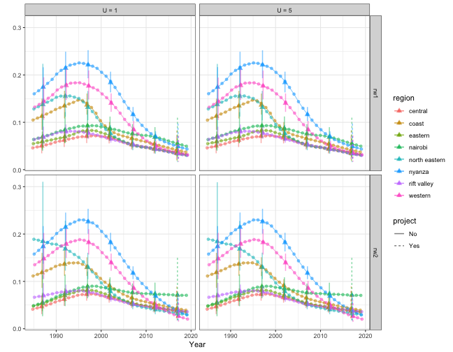

In this vignette, we use real data from Kenya 2014 DHS survey to illustrate spatial and spatial-temporal smoothing of child mortality rates using smoothed direct estimation. We focus on subnational under-five mortality rates (U5MR) is this example, although similar analysis could be carried out for other quantities of interest such as neonate mortality rates. We use Kenya 2014 DHS survey as an example and calculate subnational estimates at province levels for 5-year periods. The SAE model we discuss use direct estimates for 5-year periods as input, and produces estimates on both period and yearly levels.


## Pre-processing the data

First, we load the package and the necessary data. INLA is not in a standard repository, so we check if it is available and install it if it is not installed. For this vignette, we used INLA version 20.03.17.


```r
library(SUMMER)
library(ggplot2)
library(patchwork)
library(rdhs)
library(haven)
library(sf)
```

The DHS data can be obtained from the DHS program website at [https://dhsprogram.com/data/dataset/Kenya_Standard-DHS_2014](https://dhsprogram.com/data/dataset/Kenya_Standard-DHS_2014.cfm?flag=0). For the analysis of U5MR, we will use the Births Recode in .dta  format. Notice that registration with the DHS program is required in order to access this dataset. Below we show two ways to read in the files.

One option is to download both the DHS birth record data and the corresponding shapefiles from the website and save them in the local directory. We can load them into \texttt{R} with packages **readstata13**. 


```r
library(readstata13)
filename <- "data/KEBR71DT/KEBR71FL.DTA"
births <- read.dta13(filename, generate.factors = TRUE)
```


Another option is to use the **rdhs** package. It allows users to download DHS datasets directly from within R session. We first look up the DHS surveys in Kenya.


```r
sv <- dhs_surveys(countryIds = "KE", surveyType = "DHS")
sv[, c("SurveyId", "FieldworkStart", "FieldworkEnd")]
```

```
##    SurveyId FieldworkStart FieldworkEnd
## 1 KE1989DHS     1988-12-01   1989-05-01
## 2 KE1993DHS     1993-02-01   1993-08-01
## 3 KE1998DHS     1998-02-01   1998-07-01
## 4 KE2003DHS     2003-04-01   2003-09-01
## 5 KE2008DHS     2008-11-01   2009-02-01
## 6 KE2014DHS     2014-05-01   2014-10-01
## 7 KE2022DHS     2022-02-01   2022-07-01
```

We download the 2014 Kenya DHS data. Notice for the first time users, a DHS key is required from registering at DHS website and in the **rdhs** package.


```r
BR <- dhs_datasets(surveyIds = sv$SurveyId[6], fileFormat = "STATA", fileType = "BR")
BRfiles <- get_datasets(BR$FileName, reformat = TRUE, download_option = "zip")
BRfiles
```

```
## $KEBR72DT
## [1] "~/Library/Caches/rdhs/datasets_reformatted/KEBR72DT.ZIP"
## 
## attr(,"reformat")
## [1] TRUE
```


We use the **haven** package to read in the birth record file from the downloaded zip folder and make the region variable `v024` into factors.


```r
births <- read_dta(unz(BRfiles[[1]], "KEBR72FL.DTA"))
births$v024 <- as_factor(births$v024)
births$b5 <- as_factor(births$b5)
```

The map files for this DHS can be freely downloaded from [https://spatialdata.dhsprogram.com/boundaries/](https://spatialdata.dhsprogram.com/boundaries/). We load the downloaded shapefile from using the **sf** package. We also generates the spatial adjacency matrix `Amat` using the function `getAmat()`.


```r
mapfilename <- "data/shps/sdr_subnational_boundaries.shp"
sf_use_s2(FALSE)
geo <- read_sf(mapfilename)
```

```
## Error: Cannot open "data/shps/sdr_subnational_boundaries.shp"; The file doesn't seem to exist.
```

```r
Amat <- getAmat(geo, geo$REGNAME)
```

```
## Error in eval(expr, envir, enclos): object 'geo' not found
```


The `Amat` matrix encodes the spatial adjacency matrix of the 8 Admin-1 region groups, with column and row names matching the regions used in the map. This adjacency matrix will be used for the spatial smoothing model. It can also be created by hand if necessary. 


## Bayesian space-time smoothing of direct estimates

### Prepare person-month data

We first demonstrate the method that smooths the direct estimates of subnational-level U5MR. For this analysis, we consider the $8$ Admin-1 region groups. In order to calculate the direct estimates of U5MR, we need the full birth history data in the format so that every row corresponds to a birth and columns that contain:

+ Indicators corresponding to survey design, e.g., strata (`v023`), cluster (`v001`), and household (`v002`)
+ Survey weight (`v025`)
+ Date of interview in century month codes (CMC) format, i.e., the number of the month since the beginning of 1900 (`v008`)
+ Date of child’s birth in CMC format (`b3`)
+ Indicator for death of child (`b5`)
+ Age of death of child in months (`b7`)

The birth history data from DHS is already in this form and the `getBirths` function default to use the current recode manual column names (as indicated above). The name of these fields can be defined explicitly in the function arguments too. We reorganize the data into the 'person-month' format with `getBirths` function and reorder the columns for better readability. Notice that DHS reports age in years for children over 2 years old. Thus the `b7` variable contains ages mostly in multiples of 12 after 24 months. This truncation is adjusted by the `age.truncate = 24` argument, which adds 5 months to the age of the children for any records at least 24 months old and the age being multiples of 12. We also specify the `surveyyear` argument to remove any observations that fall into time periods after 2014, which could exist in the adjusted dataset.


```r
dat <- getBirths(data = births, strata = c("v023"), surveyyear = 2014, year.cut = seq(1985,
    2020, by = 5))
dat <- dat[, c("v001", "v002", "v024", "time", "age", "v005", "strata", "died")]
colnames(dat) <- c("clustid", "id", "region", "time", "age", "weights", "strata",
    "died")
head(dat)
```

```
##   clustid id  region  time  age weights strata died
## 1       1  6 nairobi 05-09    0 5476381      1    0
## 2       1  6 nairobi 05-09 1-11 5476381      1    0
## 3       1  6 nairobi 05-09 1-11 5476381      1    0
## 4       1  6 nairobi 05-09 1-11 5476381      1    0
## 5       1  6 nairobi 05-09 1-11 5476381      1    0
## 6       1  6 nairobi 05-09 1-11 5476381      1    0
```

Notice that we also need to specify the time intervals of interest. In this example, we with to calculate and predict U5MR in 5-year intervals from 1985-1990 to 2015-2019. For U5MR, we will use the discrete survival model to calculate direct estimates for each region and time. This step involves breaking down the age of each death into discrete intervals. The default option assumes a discrete survival model with six discrete hazards (probabilities of dying in a particular interval, given survival to the start of the interval) for each of the age bands: $[0,1), [1,12), [12,24), [24,36), [36,48)$, and $[48,60]$. 

We may also calculate other types of mortality rates of interest using `getBirths`. For example, for U1MR, 


```r
dat_infant = getBirths(data = births, surveyyear = 2014, month.cut = c(1, 12), strata = c("v023"))
```
And the smoothing steps can be similarly carried out. 

### Horvitz-Thompson estimators of U5MR

Using the person-month format data, we can calculate Horvitz-Thompson estimators using `getDirect` for a single survey or `getDirectList` for multiple surveys. The discrete hazards in each time interval are estimated using a logistic regression model, with weighting to account for the survey design. The direct estimates are then calculated using the discrete hazards. In order to correctly account for survey design, We need to specify the stratification and cluster variables. In the Kenya DHS example, a two-stage stratified cluster sampling design was used, where strata are specified in the ``strata`` column, and clusters are specified by the cluster ID (`clusterid`) and household ID (`id`). 


```r
years <- levels(dat$time)
direct0 <- getDirect(births = dat, years = years, regionVar = "region", timeVar = "time",
    clusterVar = "~clustid + id", ageVar = "age", weightsVar = "weights")
head(direct0)
```

```
##   region years  mean lower upper logit.est var.est survey logit.prec
## 1    All 85-89 0.093 0.079 0.109      -2.3  0.0082     NA        122
## 2    All 90-94 0.098 0.089 0.109      -2.2  0.0033     NA        306
## 3    All 95-99 0.088 0.081 0.097      -2.3  0.0024     NA        409
## 4    All 00-04 0.078 0.072 0.084      -2.5  0.0016     NA        630
## 5    All 05-09 0.059 0.054 0.064      -2.8  0.0020     NA        506
## 6    All 10-14 0.051 0.047 0.056      -2.9  0.0021     NA        472
```


### Adjustments using external information

Sometimes additional information are available to adjust the direct estimates from the surveys. For example, in countries with high prevalence of HIV, estimates of U5MR can be biased, particularly before ART treatment became widely available. Pre-treatment HIV positive women had a high risk of dying, and such women who had given birth were therefore less likely to appear in surveys. The children of HIV positive women are also more likely to have a higher probability of dying compared to those born to HIV negative women. Thus we expect that the U5MR is underestimated if we do not adjust for the missing women.


Suppose we can obtain the ratio of the reported U5MR to the true U5MR, $r_{it}$, at region $i$ and time period $t$, we can apply the adjustment factor to the direct estimates and the associated variances. The HIV adjustment factors were calculated for the 2014 Kenya DHS survey and included in the package.


```r
data(KenData)
direct <- getAdjusted(data = direct0, ratio = KenData$HIV2014, logit.lower = NA,
    logit.upper = NA, prob.lower = "lower", prob.upper = "upper")
```

### National estimates of U5MR
The direct estimates calculated using `getDirect` contains both national estimates and subnational estimates for the $8$ regions, over the $6$ time periods and the projection period 2015-2019. We first fit a model with temporal random effects only to smooth the national estimates over time. In this part, we use the subset of data region variable being "All".  We can fit a Random Walk 2 only model defined on the 5-year period.


```r
fit1 <- smoothDirect(data = direct, Amat = NULL, year_label = years, year_range = c(1985,
    2019), time.model = "rw2", m = 1)
```

We can also estimate the Random Walk 2 random effects on the yearly scale. 


```r
fit2 <- smoothDirect(data = direct, Amat = NULL, year_label = years, year_range = c(1985,
    2019), time.model = "rw2", m = 5)
```

The marginal posteriors are already stored in the fitted object. We use the following function to extract and re-arrange them.


```r
out1 <- getSmoothed(fit1)
out2 <- getSmoothed(fit2)
```


We can compare the results visually. Notice to correctly display the period estimates, the reference year in each period needs to be specified. Here we simply take the median year in each period.


```r
years.ref <- c(1987, 1992, 1997, 2002, 2007, 2012, 2017)
g1 <- plot(out1, year_med = years.ref) + ggtitle("National period model") + ylim(c(0,
    0.17))
g2 <- plot(out2, year_med = years.ref) + ggtitle("National yearly model") + ylim(c(0,
    0.17))
g1 + g2
```


The national model also allows us to benchmark the estimates using other published national results. For example, we take the 2019 UN-IGME estimates and find the median under-5 mortality rates in each periods. We can then calculate the ratio of the estimates from national models to the published UN estimates. 


```r
data(KenData)
UN <- KenData$IGME2019
UN.period <- data.frame(period = c("85-89", "90-94", "95-99", "00-04", "05-09", "10-14"),
    median = NA)
for (i in 1:6) {
    UN.period$median[i] <- median(UN$mean[which(UN$years %in% (c(1985:1989) + (i -
        1) * 5))])
}
ratio <- subset(out1, region == "All")$median[1:6]/UN.period$median
print(ratio)
```

```
## [1] 0.98 0.95 0.91 0.95 0.92 1.00
```

We will use this adjustment ratio to correct the bias from our direct estimates. We organize the adjustment ratios into a matrix of two columns, since the adjustment factor only varies over time. We can then perform the benchmarking to the UN estimates similar to the HIV adjustment before.


```r
benchmark <- data.frame(years = c("85-89", "90-94", "95-99", "00-04", "05-09", "10-14"),
    ratio = ratio)
direct <- getAdjusted(data = direct, ratio = benchmark, time = "years", region = "region",
    est = "mean", logit.lower = "logit.lower", logit.upper = "logit.upper")
```

After benchmarking, we can fit the smoothing model again on the adjusted direct estimates, and see if they align with the UN estimates.


```r
fit2.benchmark <- smoothDirect(data = direct, Amat = NULL, year_label = years, year_range = c(1985,
    2019), time.model = "rw2", m = 5)
out2.benchmark <- getSmoothed(fit2.benchmark)

g1 <- plot(out2, year_label = years, year_med = years.ref, data.add = UN, option.add = list(point = "mean"),
    label.add = "UN", color.add = "orange") + ggtitle("National yearly model: original") +
    ylim(c(0, 0.17))
g2 <- plot(out2.benchmark, year_label = years, year_med = years.ref, data.add = UN,
    option.add = list(point = "mean"), label.add = "UN", color.add = "orange") +
    ggtitle("National yearly model: benchmarked") + ylim(c(0, 0.17))
g1 + g2
```


### Subnational estimates of U5MR

The syntax to fit subnational smoothing model is similar. Similar to the national model, we can choose to estimate temporal random effects on either yearly or period level. We can also choose the four types of space-time interaction terms using the `st.type` argument. The default hyper priors on the precision of random effects are now PC priors. 


```r
fit3 <- smoothDirect(data = direct, Amat = Amat, year_label = years, year_range = c(1985,
    2019), time.model = "rw2", type.st = 4, m = 1)
```

```
## Error in eval(expr, envir, enclos): object 'Amat' not found
```

```r
out3 <- getSmoothed(fit3)
```

```
## Error in eval(expr, envir, enclos): object 'fit3' not found
```

Similarly we can also estimate the Random Walk 2 random effects on the yearly scale. 


```r
fit4 <- smoothDirect(data = direct, Amat = Amat, year_label = years, year_range = c(1985,
    2019), time.model = "rw2", type.st = 4, m = 5)
```

```
## Error in eval(expr, envir, enclos): object 'Amat' not found
```

```r
out4 <- getSmoothed(fit4)
```

```
## Error in eval(expr, envir, enclos): object 'fit4' not found
```

```r
g1 <- plot(out3) + ggtitle("Subnational period model") + ylim(c(0, 0.3))
```

```
## Error in h(simpleError(msg, call)): error in evaluating the argument 'x' in selecting a method for function 'plot': object 'out3' not found
```

```r
g2 <- plot(out4) + ggtitle("Subnational yearly model") + ylim(c(0, 0.3))
```

```
## Error in h(simpleError(msg, call)): error in evaluating the argument 'x' in selecting a method for function 'plot': object 'out4' not found
```

```r
g1 + g2
```


We can also add back the direct estimates for comparison.


```r
plot(out4, data.add = direct, option.add = list(point = "mean", by = "survey")) +
    facet_wrap(~region, scales = "free")
```

```
## Error in h(simpleError(msg, call)): error in evaluating the argument 'x' in selecting a method for function 'plot': object 'out4' not found
```
 
We can show the estimates over time on maps. We revert the color scale so that higher mortality are represented by darker colors. 


```r
mapPlot(data = subset(out4, is.yearly == FALSE), geo = geo, variables = "years",
    values = "median", by.data = "region", by.geo = "REGNAME", is.long = TRUE, ncol = 4,
    direction = -1, legend.label = "U5MR", per1000 = TRUE)
```

```
## Error in eval(expr, envir, enclos): object 'geo' not found
```

In order to also illustrate uncertainties of the estimates when presented on maps, we can use hatching to indicate the width of the 94% posterior credible intervals.


```r
hatchPlot(data = subset(out4, is.yearly == FALSE), geo = geo, variables = "years",
    values = "median", by.data = "region", by.geo = "REGNAME", lower = "lower", upper = "upper",
    is.long = TRUE, direction = -1, legend.label = "U5MR", per1000 = TRUE, ncol = 4)
```

```
## Error in eval(expr, envir, enclos): object 'geo' not found
```


## Comparing different models
In this section, we compare models with different prior setup. We focus on the subnational models with yearly temporal resolution. We use random walk of order 2 to model the main temporal trend, and compare different priors for the space-time interaction term. We consider both random walk of order 1 and 2, and PC priors with $U = 1, 5$. It can be seen that with RW2 interaction, the region specific U5MR are allowed to follow their own trends with no regulation in their slopes. On the other hand, RW1 interaction stays constant after observation periods ends instead of following region-specific trends. This can be seen more clearly with the interaction effect plots at the end. The posterior is not sensitive to the choice of $U$.


```r
index <- 1
f.list <- NULL
est.list <- NULL
for (model in c("rw1", "rw2")) {
    for (u in c(1, 5)) {
        f <- smoothDirect(data = direct, Amat = Amat, year_range = c(1985, 2019),
            year_label = years, time.model = "rw2", st.time.model = model, m = 5,
            type.st = 4, pc.st.u = u, pc.st.alpha = 0.01)
        f.list[[index]] <- f
        out <- getSmoothed(f)
        out$st.model <- model
        out$st.u <- paste("U =", u)
        est.list <- rbind(est.list, out)
        index <- index + 1
    }
}
```

```
## Error in eval(expr, envir, enclos): object 'Amat' not found
```

```r
plot(est.list, plot.CI = TRUE) + facet_grid(st.model ~ st.u)
```

```
## Error in plot.window(...): need finite 'xlim' values
```


