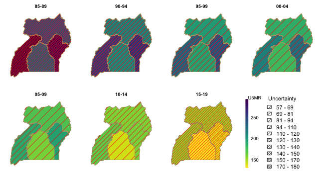

In this vignette, we will discuss the use of both area and cluster-level models using the SUMMER package. We will use the simulated surveys in the `DemoData` dataset in the package. The `DemoData` object is a list that contains full birth history data from simulated surveys with stratified cluster sampling design, similar to most of the DHS surveys. It has been pre-processed into the person-month format, where for each list entry, each row represents one person-month record. Each record contains columns for the cluster ID (`clustid`), household ID (`id`), strata membership (`strata`) and survey weights (`weights`). The region and time period associated with each person-month record has also been computed and saved in the dataset. Raw DHS data can be processed into this format using the `getBirths` function.  


# Load Data

We first load the package and data. We will use the **dplyr** package in some data processing steps, and **ggplot2** and **patchwork** for visualization. 


```r
library(SUMMER)
data(DemoData)
library(dplyr)
library(ggplot2)
library(patchwork)
```

`DemoData` contains model survey data provided by DHS. Note that this data is simulated and does not represent any real country's data. `DemoData` is obtained by processing the raw DHS birth data (in .dta format) in R. The raw file of birth recodes can be downloaded from the DHS website [https://dhsprogram.com/data/Download-Model-Datasets.cfm](https://dhsprogram.com/data/Download-Model-Datasets.cfm). For this demo dataset, no registration is needed. For real DHS survey datasets, permission to access needs to be registered with DHS directly. `DemoData` contains a small sample of the observations in this dataset randomly assigned to $5$ example DHS surveys.

For more details, the following code snippet demonstrates how to split the raw demo data into person-month format from similar to that in the `DemoData` object. Notice that to read the file from early version of stata, the package `readstata13` is required. The following script is based on the example dataset `ZZBR62FL.DTA` available from the DHS website. We use the interaction of v024 and v025 as the strata indicator for the purpose of demonstration. We can see from ``range(data$v008)`` that the CMC code for the date of interview corresponds to the year ``1900 + floor(1386/12)= 2015``. In practice, however, the survey year is usually known. The survey year variable allows the mis-recorded data. Dates after the ``surveyyear`` will be removed. Thus for survey taking place over multiple years, the later year is suggested to be used as `surveyyear`. If set to NA then no checking will be performed.


```r
library(readstata13)
my_fp <- "data/ZZBR62DT/ZZBR62FL.DTA"
dat <- getBirths(filepath = my_fp, surveyyear = 2015, strata = c("v024", "v025"))
dat <- dat[, c("v001", "v002", "v024", "per5", "ageGrpD", "v005", "strata", "died")]
colnames(dat) <- c("clustid", "id", "region", "time", "age", "weights", "strata",
    "died")
```

Back to the pre-processed dataset, `DemoData` is a list of $5$ data frames where each row represent one person-month record and contains the $8$ variables as shown below. Notice that `time` variable is turned into 5-year bins from `80-84` to `10-14`. 


```r
summary(DemoData)
```

```
##      Length Class      Mode
## 1999 8      data.frame list
## 2003 8      data.frame list
## 2007 8      data.frame list
## 2011 8      data.frame list
## 2015 8      data.frame list
```

```r
head(DemoData[[1]])
```

```
##   clustid id  region  time  age weights        strata died
## 1       1  1 eastern 00-04    0     1.1 eastern.rural    0
## 2       1  1 eastern 00-04 1-11     1.1 eastern.rural    0
## 3       1  1 eastern 00-04 1-11     1.1 eastern.rural    0
## 4       1  1 eastern 00-04 1-11     1.1 eastern.rural    0
## 5       1  1 eastern 00-04 1-11     1.1 eastern.rural    0
## 6       1  1 eastern 00-04 1-11     1.1 eastern.rural    0
```

For demonstration purpose, we associate the regions in this simulated dataset with an example map stored in the `DemoMap` object in the SUMMER package. `DemoMap` contains geographic data from the 1995 Uganda Admin 1 regions defined by DHS. It contains a SpatialPolygonsDataFrame object `geo` and the corresponding spatial adjacency matrix `mat`. 


```r
data(DemoMap)
geo <- DemoMap$geo
mat <- DemoMap$Amat
```

The spatial adjacency matrix can also be created directly from the SpatialPolygonsDataFrame by

```r
mat <- getAmat(geo, geo$REGNAME)
```

Finally, more details on the pipeline of downloading and processing raw DHS data and shapefiles can be found in the vignette _A Case Study of Estimating Subnational U5MR using DHS data_.


# Direct estimates

First, we obtain Horvitz-Thompson estimators using `getDirectList`. We specify the survey design as the two-stage stratified cluster sampling where strata are specified in the ``strata`` column, and clusters are specified by both the cluster ID (`clusterid`) and household ID (`id`). 


```r
years <- levels(DemoData[[1]]$time)
data_multi <- getDirectList(births = DemoData, years = years, regionVar = "region",
    timeVar = "time", clusterVar = "~clustid+id", ageVar = "age", weightsVar = "weights",
    geo.recode = NULL)
```

Before fitting the model, we also aggregate estimates based on different surveys into a single set of estimates, using the inverse design-based variances as the weights. 


```r
dim(data_multi)
```

```
## [1] 150  10
```

```r
data <- aggregateSurvey(data_multi)
dim(data)
```

```
## [1] 30 10
```

# Area-level model for U5MR
 
## National estimates of U5MR

With the combined direct estimates, we are ready to fit the smoothing models described in @li_etal_19. First, we ignore the subnational estimates, and fit a model with temporal random effects only. In this part, we use the subset of data region variable being "All".  In fitting this model, we first define the list of time periods we wish to project the estimates on. First we can fit a Random Walk 2 only model defined on the 5-year period. The argument ``m = 1`` specifies that the random walk is in the same temporal resolution as the input data. See the next example for the case where the random walk model is specified at a higher resolution.


```r
years.all <- c(years, "15-19")
fit1 <- smoothDirect(data = data, Amat = NULL, year_label = years.all, year_range = c(1985,
    2019), time.model = "rw2", m = 1)
```

```
## ----------------------------------
## Smoothed Direct Model
##   Main temporal model:        rw2
##   Number of time periods:     35
##   Temporal resolution:        period model (m = 1)
## ----------------------------------
```

```r
summary(fit1)
```

```
## ----------------------------------
## Smoothed Direct Model
##   Main temporal model:        rw2
##   Number of time periods:     35
##   Temporal resolution:        period model (m = 1)
## ----------------------------------
## Fixed Effects
##             mean    sd 0.025quant 0.5quant 0.97quant mode kld
## (Intercept) -1.4 0.081       -1.6     -1.4      -1.3 -1.4   0
## ----------------------------------
## Random Effects
##            Name     Model
## 1   time.struct RW2 model
## 2 time.unstruct IID model
## ----------------------------------
## Model hyperparameters
##                             mean   sd 0.025quant 0.5quant 0.97quant mode
## Precision for time.struct   1212 9510        5.4      140      6882  9.8
## Precision for time.unstruct 1191 6732       11.2      207      6959 23.3
## NULL
##                                       [,1]
## log marginal-likelihood (integration) -2.1
## log marginal-likelihood (Gaussian)    -1.9
```

When data is sparse, direct estimates at yearly level may be unstable. This is why we used 5-year periods as the model's temporal resolution in this example. When performing temporal smoothing, however, we can define the temporal smoother on the yearly scale instead. Notice that the direct estimates are still calculated in 5-year intervals, but the smoothed estimator now produce estimates at both yearly and period resolutions. 


```r
fit2 <- smoothDirect(data = data, Amat = NULL, year_label = years.all, year_range = c(1985,
    2019), time.model = "rw2", m = 5, type.st = 4)
```

```
## ----------------------------------
## Smoothed Direct Model
##   Main temporal model:        rw2
##   Number of time periods:     35
##   Temporal resolution:        yearly model (m = 5)
## ----------------------------------
```

```r
summary(fit2)
```

```
## ----------------------------------
## Smoothed Direct Model
##   Main temporal model:        rw2
##   Number of time periods:     35
##   Temporal resolution:        yearly model (m = 5)
## ----------------------------------
## Fixed Effects
##             mean    sd 0.025quant 0.5quant 0.97quant mode kld
## (Intercept) -1.4 0.074       -1.6     -1.4      -1.3 -1.4   0
## ----------------------------------
## Random Effects
##            Name     Model
## 1   time.struct RGeneric2
## 2 time.unstruct RGeneric2
## ----------------------------------
## Model hyperparameters
##                          mean  sd 0.025quant 0.5quant 0.97quant mode
## Theta1 for time.struct    5.0 1.9        1.6      5.0       8.8  4.6
## Theta1 for time.unstruct  4.3 1.8        1.1      4.2       7.8  3.9
## NULL
##                                       [,1]
## log marginal-likelihood (integration)  -75
## log marginal-likelihood (Gaussian)     -75
```

The marginal posteriors are already stored in the fitted object. We use the following function to extract and re-arrange them.


```r
out1 <- getSmoothed(fit1)
out2 <- getSmoothed(fit2)
```

We can compare the results visually using the function below.


```r
g1 <- plot(out1) + ggtitle("National period model")
g2 <- plot(out2) + ggtitle("National yearly model")
g1 + g2
```


## Subnational estimates of U5MR  

Now we fit the full model on all subnational regions. First, we use the Random Walk 2 model defined on the 5-year period. 


```r
fit3 <- smoothDirect(data = data, Amat = mat, year_label = years.all, year_range = c(1985,
    2019), time.model = "rw2", m = 1, type.st = 4)
```

```
## ----------------------------------
## Smoothed Direct Model
##   Main temporal model:        rw2
##   Number of time periods:     35
##   Temporal resolution:        period model (m = 1)
##   Spatial effect:             bym2
##   Number of regions:          4
##   Interaction temporal model: rw2
##   Interaction type:           4
## ----------------------------------
```

```r
out3 <- getSmoothed(fit3)
```

Similarly we can also estimate the Random Walk 2 random effects on the yearly scale. 


```r
fit4 <- smoothDirect(data = data, Amat = mat, year_label = years.all, year_range = c(1985,
    2019), time.model = "rw2", m = 5, type.st = 4)
```

```
## ----------------------------------
## Smoothed Direct Model
##   Main temporal model:        rw2
##   Number of time periods:     35
##   Temporal resolution:        yearly model (m = 5)
##   Spatial effect:             bym2
##   Number of regions:          4
##   Interaction temporal model: rw2
##   Interaction type:           4
## ----------------------------------
```

```r
out4 <- getSmoothed(fit4)
```

The figures below shows the comparison of the subnational model with different temporal scales.


```r
g1 <- plot(out3, is.yearly = FALSE) + ggtitle("Subnational period model")
g2 <- plot(out4, is.yearly = TRUE) + ggtitle("Subnational yearly model")
g1 + g2
```


We can also add back the direct estimates for comparison when plotting the smoothed estimates.


```r
plot(out4, is.yearly = TRUE, data.add = data_multi, option.add = list(point = "mean",
    by = "surveyYears")) + facet_wrap(~region, scales = "free")
```


Finally, we show the estimates over time on maps.


```r
mapPlot(data = subset(out4, is.yearly == F), geo = DemoMap$geo, variables = c("years"),
    values = c("median"), by.data = "region", by.geo = "NAME_final", is.long = TRUE,
    ncol = 4)
```


# Cluster-level model for U5MR


We now describe the fitting of the cluster-level model for U5MR described in @li2020space and @fuglstad2021two. For this simulated dataset, the strata variable is coded as region crossed by urban/rural status. For our analysis with urban/rural stratified model, we first construct a new strata variable that contains only the urban/rural status, i.e., the additional stratification within each region.


```r
for (i in 1:length(DemoData)) {
    strata <- DemoData[[i]]$strata
    DemoData[[i]]$strata[grep("urban", strata)] <- "urban"
    DemoData[[i]]$strata[grep("rural", strata)] <- "rural"
}
```


To fit the cluster-level model, we calculate the number of person-months and number of deaths for each cluster, time period, and age group. We first create the data frame using the `getCounts` function for each survey and combine them into a single data frame. 

The model fitting function `smoothCluster` expects columns with specific names. We rename the cluster ID and time period columns to be 'cluster' and 'years'. The response variable is 'Y' and the binomial total is 'total'.


```r
counts.all <- NULL
for (i in 1:length(DemoData)) {
    vars <- c("clustid", "region", "strata", "time", "age")
    counts <- getCounts(DemoData[[i]][, c(vars, "died")], variables = "died", by = vars,
        drop = TRUE)
    counts <- counts %>%
        mutate(cluster = clustid, years = time, Y = died)
    counts$survey <- names(DemoData)[i]
    counts.all <- rbind(counts.all, counts)
}
```

With the created data frame, we fit the cluster-level model using the `smoothCluster` function. Notice that here we need to specify the age groups (`age.groups`), the length of each age group (`age.n`) in months, and how the age groups are mapped to the temporal random effects (`age.rw.group`). In the default case, `age.rw.group = c(1, 2, 3, 3, 3, 3)` means the first two age groups each has its own temporal trend, the the following four age groups share the same temporal trend. We start with the default temporal model of random walk or order 2 on the 5-year periods in this dataset (with real data, we can use a finer temporal resolution). For the space-time interaction, we use an AR(1) prior (specified by `st.time.model`) interacting with a spatial ICAR prior, with random linear trends in each area (specified by `pc.st.slope.u` and `pc.st.slope.alpha`). We add survey iid effects to the model as well using `survey.effect = TRUE` argument. The temporal main effects are defined for each stratum separately (specified by `strata.time.effect = TRUE`, so in total six random walks are used to model the main temporal effect. 


```r
periods <- c("85-89", "90-94", "95-99", "00-04", "05-09", "10-14")
fit.bb  <- smoothCluster(data = counts.all, Amat = DemoMap$Amat, 
					family = "betabinomial",
					year_label = c(periods, "15-19"), 
					age.groups = c("0", "1-11", "12-23", "24-35", "36-47", "48-59"),
					age.n = c(1, 11, 12, 12, 12, 12),
					age.rw.group = c(1, 2, 3, 3, 3, 3),
					time.model = "rw2",
					st.time.model = "ar1",
					pc.st.slope.u = 1, pc.st.slope.alpha = 0.01,
					survey.effect = TRUE, 
					strata.time.effect = TRUE)
```

```
## Argument 'age.rw.group' have been deprecated and replaced by 'age.time.group' in version 1.4.0. The value for 'age.time.group' has been set to be the input argument 'age.rw.group'
```

```
## ----------------------------------
## Cluster-level model
##   Main temporal model:        rw2
##   Number of time periods:     7
##   Spatial effect:             bym2
##   Number of regions:          4
##   Interaction temporal model: ar1
##   Interaction type:           4
##   Interaction random slopes:  yes
##   Number of age groups: 6
##   Stratification: yes
##   Number of age-specific fixed effect intercept per stratum: 6
##   Number of age-specific trends per stratum: 3
##   Strata-specific temporal trends: yes
##   Survey effect: yes
## ----------------------------------
```

```r
summary(fit.bb)
```

```
## ----------------------------------
## Cluster-level model
##   Main temporal model:        rw2
##   Number of time periods:     7
##   Spatial effect:             bym2
##   Number of regions:          4
##   Interaction temporal model: ar1
##   Interaction type:           4
##   Interaction random slopes:  yes
##   Number of age groups: 6
##   Stratification: yes
##   Number of age group fixed effect intercept per stratum: 6
##   Number of age-specific trends per stratum: 3
##   Strata-specific temporal trends: yes
##   Survey effect: yes
## ----------------------------------
## Fixed Effects
##                          mean   sd 0.025quant 0.5quant 0.97quant mode kld
## age.intercept0:rural     -3.0 0.14       -3.3     -3.0      -2.7 -3.0   0
## age.intercept1-11:rural  -4.7 0.11       -4.9     -4.7      -4.5 -4.7   0
## age.intercept12-23:rural -5.8 0.14       -6.1     -5.8      -5.5 -5.8   0
## age.intercept24-35:rural -6.6 0.20       -6.9     -6.6      -6.2 -6.6   0
## age.intercept36-47:rural -6.9 0.23       -7.3     -6.9      -6.4 -6.9   0
## age.intercept48-59:rural -7.3 0.29       -7.9     -7.3      -6.8 -7.3   0
## age.intercept0:urban     -2.7 0.13       -3.0     -2.7      -2.5 -2.7   0
## age.intercept1-11:urban  -5.0 0.13       -5.2     -5.0      -4.7 -5.0   0
## age.intercept12-23:urban -5.7 0.17       -6.1     -5.7      -5.4 -5.7   0
## age.intercept24-35:urban -7.1 0.28       -7.6     -7.1      -6.5 -7.1   0
## age.intercept36-47:urban -7.6 0.37       -8.3     -7.6      -6.9 -7.6   0
## age.intercept48-59:urban -8.0 0.46       -8.9     -8.0      -7.1 -8.0   0
## 
## Slope fixed effect index:
## time.slope.group1: 0:rural
## time.slope.group2: 1-11:rural
## time.slope.group3: 12-23:rural, 24-35:rural, 36-47:rural, 48-59:rural
## time.slope.group4: 0:urban
## time.slope.group5: 1-11:urban
## time.slope.group6: 12-23:urban, 24-35:urban, 36-47:urban, 48-59:urban
## ----------------------------------
## Random Effects
##            Name             Model
## 1   time.struct         RW2 model
## 2 time.unstruct         IID model
## 3 region.struct        BYM2 model
## 4    region.int Besags ICAR model
## 5   st.slope.id         IID model
## 6     survey.id         IID model
## ----------------------------------
## Model hyperparameters
##                                                     mean       sd 0.025quant
## overdispersion for the betabinomial observations   0.002    0.001      0.001
## Precision for time.struct                         89.127  107.545     11.587
## Precision for time.unstruct                      835.404 3162.330     13.344
## Precision for region.struct                      362.694 1178.564      7.304
## Phi for region.struct                              0.347    0.237      0.029
## Precision for region.int                         662.287 2901.332      6.107
## Group PACF1 for region.int                         0.898    0.190      0.304
## Precision for st.slope.id                        106.781  393.439      1.313
##                                                  0.5quant 0.97quant   mode
## overdispersion for the betabinomial observations    0.002     0.005  0.002
## Precision for time.struct                          57.308   338.863 27.622
## Precision for time.unstruct                       219.625  4806.292 28.959
## Precision for region.struct                       109.650  2037.244 16.380
## Phi for region.struct                               0.300     0.844  0.088
## Precision for region.int                          146.979  3888.536 11.031
## Group PACF1 for region.int                          0.971     1.000  1.000
## Precision for st.slope.id                          27.986   615.455  2.528
## NULL
##                                        [,1]
## log marginal-likelihood (integration) -3454
## log marginal-likelihood (Gaussian)    -3449
```

In this example, we do not have any bias adjustment in this simple model. If the ratio adjustments to U5MR are known, they could be entered with the `bias.adj` and `bias.adj.by` arguments when fitting the model.


Posterior samples from the model are taken and summarized using the `getSmoothed` function. For models with a large number of areas and time points, this step may take some time to compute. The `save.draws` argument makes it possible to save the raw posterior draws, so that we can use them again in other functions or recompute different posterior credible intervals.   


```r
est.bb <- getSmoothed(fit.bb, nsim = 1000, CI = 0.95, save.draws = TRUE)
summary(est.bb)
```

```
## ---------------------------------------------
## Stratified estimates stored in ...$stratified
## Aggregated estimates stored in ...$overall
## ---------------------------------------------
## Estimates computed for 7 time period(s) and 4 area(s)
## No strata weights has been supplied. Overall estimates are not calculated.
## Posterior draws are saved in the output. You can use 'getSmoothed(..., draws = ...$draws)' next time to speed up the call.
## 1000 posterior draws taken.
```

For example, to recompute the posterior CI directly using the existing draws:


```r
est.bb.90CI <- getSmoothed(fit.bb, nsim = 1000, CI = 0.95, draws = est.bb$draws)
```

## Aggregation across strata

The `est.bb` object above computes the U5MR estimates by urban/rural strata. In order to obtain the overall region-specific U5MR, we need additional information on the population fractions of each stratum within regions. As an demonstration, we simulate the population totals over the years with


```r
pop.base <- expand.grid(region = c("central", "eastern", "northern", "western"),
    strata = c("urban", "rural"))
pop.base$population <- round(runif(dim(pop.base)[1], 1000, 20000))
periods.all <- c(periods, "15-19")
pop <- NULL
for (i in 1:length(periods.all)) {
    tmp <- pop.base
    tmp$population <- pop.base$population + round(rnorm(dim(pop.base)[1], mean = 0,
        sd = 200))
    tmp$years <- periods.all[i]
    pop <- rbind(pop, tmp)
}
head(pop)
```

```
##     region strata population years
## 1  central  urban      16641 85-89
## 2  eastern  urban       2662 85-89
## 3 northern  urban       4307 85-89
## 4  western  urban      13222 85-89
## 5  central  rural      16821 85-89
## 6  eastern  rural      17979 85-89
```

In order to compute the aggregated estimates, we need the proportion of urban/rural populations within each region in each time period.


```r
weight.strata <- expand.grid(region = c("central", "eastern", "northern", "western"),
    years = periods.all)
weight.strata$urban <- weight.strata$rural <- NA
for (i in 1:dim(weight.strata)[1]) {
    which.u <- which(pop$region == weight.strata$region[i] & pop$years == weight.strata$years[i] &
        pop$strata == "urban")
    which.r <- which(pop$region == weight.strata$region[i] & pop$years == weight.strata$years[i] &
        pop$strata == "rural")
    weight.strata[i, "urban"] <- pop$population[which.u]/(pop$population[which.u] +
        pop$population[which.r])
    weight.strata[i, "rural"] <- 1 - weight.strata[i, "urban"]
}
head(weight.strata)
```

```
##     region years rural urban
## 1  central 85-89  0.50  0.50
## 2  eastern 85-89  0.87  0.13
## 3 northern 85-89  0.37  0.63
## 4  western 85-89  0.36  0.64
## 5  central 90-94  0.51  0.49
## 6  eastern 90-94  0.87  0.13
```

Now we can recompute the smoothed estimates with the population fractions.


```r
est.bb <- getSmoothed(fit.bb, nsim = 1000, CI = 0.95, save.draws = TRUE, weight.strata = weight.strata)
head(est.bb$overall)
```

```
##    region years time area variance median mean upper lower rural urban
## 5 central 85-89    1    1  0.00116   0.23 0.23  0.30  0.17  0.50  0.50
## 6 central 90-94    2    1  0.00047   0.21 0.21  0.26  0.17  0.51  0.49
## 7 central 95-99    3    1  0.00027   0.19 0.19  0.23  0.16  0.50  0.50
## 1 central 00-04    4    1  0.00023   0.18 0.18  0.21  0.15  0.51  0.49
## 2 central 05-09    5    1  0.00021   0.17 0.17  0.20  0.14  0.50  0.50
## 3 central 10-14    6    1  0.00030   0.15 0.15  0.18  0.12  0.50  0.50
##   is.yearly years.num
## 5     FALSE        NA
## 6     FALSE        NA
## 7     FALSE        NA
## 1     FALSE        NA
## 2     FALSE        NA
## 3     FALSE        NA
```

We can compare the stratum-specific and aggregated U5MR estimates now.


```r
g1 <- plot(est.bb$stratified, plot.CI = TRUE) + facet_wrap(~strata) + ylim(0, 0.5)
g2 <- plot(est.bb$overall, plot.CI = TRUE) + ylim(0, 0.5) + ggtitle("Aggregated estimates")
g1 + g2
```


# Visualizations 
 
There are extensive visualization tools in the package. We can add hatching to the map visualizations to indicate uncertainty of the estimates using `hatchPlot` with similar syntax.


```r
hatchPlot(est.bb$overall,   
		geo = DemoMap$geo, by.data = "region", by.geo = "REGNAME", 
		is.long = TRUE, variables = "years", values = "median", 
		lower = "lower", upper = "upper", hatch = "red",
		ncol = 4, direction = -1, per1000 = TRUE, legend.label = "U5MR")
```



Next we show the posterior densities of the estimates, where each each panel correspond to one time period, and the regions are ordered by the posterior median of estimates in the last year (specified by the `order = -1` argument). 


```r
ridgePlot(draws = est.bb, year_plot = periods.all,
				  ncol = 4, per1000 = TRUE, order = -1, direction = -1)
```


It can also be plotted for each region over time as well.


```r
ridgePlot(draws = est.bb, year_plot = periods.all,
				  ncol = 4, per1000 = TRUE, by.year = FALSE, direction = -1)
```


## Benchmarking to external information

When external estimates are available on the national level, we may want the subnational estimates to aggregate to the national estimates for internal validation purposes. Methods to benchmark to the national mean estimates were proposed in the literature. The vignette _A Case Study of Estimating Subnational U5MR using DHS data_ demonstrates the approach described in @li_etal_19 for the area-level model. The `bias.adj` argument in the `smoothCluster()` function allows one to adjust the estimates if the benchmarking ratio is known, using the approximation methods described in @wakefield_etal_19. We refer readers to the package document for more details. Here we demonstrate a post-processing method described by @okonek2022computationally. It has the additional advantage that both the mean and uncertainty of the national estimates are accounted for in the benchmarking process. 

To demonstrate the function, we first simulate national estimates. For a realistic simulation, we reuse the national direct estimates and add a constant bias term. We assume these estimates are from an external source. Thus we expect the estimates after benchmarking will be larger in general.


```r
national <- data.frame(years = periods.all, est = out1$median + 0.01, sd = runif(7,
    0.01, 0.03))
head(national)
```

```
##   years  est    sd
## 1 85-89 0.24 0.020
## 2 90-94 0.23 0.012
## 3 95-99 0.21 0.025
## 4 00-04 0.22 0.023
## 5 05-09 0.20 0.018
## 6 10-14 0.17 0.025
```

In order to perform the benchmarking process, we need the proportion of population by region over the time periods. We can compute these from the simulated population before.


```r
weight.region <- expand.grid(region = c("central", "eastern", "northern", "western"),
    years = periods.all)
weight.region$proportion <- NA
for (i in 1:dim(weight.region)[1]) {
    which <- which(pop$region == weight.strata$region[i] & pop$years == weight.strata$years[i])
    which.year <- which(pop$years == weight.strata$years[i])
    weight.region[i, "proportion"] <- sum(pop$population[which])/sum(pop$population[which.year])
}
head(weight.region)
```

```
##     region years proportion
## 1  central 85-89      0.410
## 2  eastern 85-89      0.253
## 3 northern 85-89      0.084
## 4  western 85-89      0.253
## 5  central 90-94      0.413
## 6  eastern 90-94      0.256
```

We perform the benchmarking procedure using the `Benchmark` function


```r
est.bb.bench <- Benchmark(est.bb, national, weight.region = weight.region, estVar = "est",
    sdVar = "sd", timeVar = "years")
```

Since the benchmarking procedure is based on a rejection sampler, the number of posterior draws accepted after benchmarking can be small, as in this example. We recommend increasing the number of draws first, i.e., 


```r
est.bb <- getSmoothed(fit.bb, nsim = 20000, CI = 0.95, save.draws = TRUE, weight.strata = weight.strata)
est.bb.bench <- Benchmark(est.bb, national, weight.region = weight.region, estVar = "est",
    sdVar = "sd", timeVar = "years")
```

We can compare the posterior median and variance before and after benchmarking.


```r
par(mfrow = c(1, 2))
plot(est.bb$overall$median, est.bb.bench$overall$median, xlab = "Before benchmarking",
    ylab = "After benchmarking", main = "Posterior median")
abline(c(0, 1))
plot(est.bb$overall$variance, est.bb.bench$overall$variance, xlab = "Before benchmarking",
    ylab = "After benchmarking", main = "Posterior variance")
abline(c(0, 1))
```


As an sanity check, we can compute the simple weighted average of the posterior median of all regions to form a set of rough national estimates. It can be seen that the benchmarked estimates are indeed higher and closer to the simulated national estimates benchmarked against.


```r
compare <- national
compare$before <- NA
compare$after <- NA
for (i in 1:dim(compare)[1]) {
    weights <- subset(weight.region, years == national$years[i])
    sub <- subset(est.bb$overall, years == national$years[i])
    sub <- merge(sub, weights)
    sub.bench <- subset(est.bb.bench$overall, years == national$years[i])
    sub.bench <- merge(sub.bench, weights)
    compare$before[i] <- sum(sub$proportion * sub$median)
    compare$after[i] <- sum(sub.bench$proportion * sub.bench$median)
}
plot(compare$est, compare$after, col = 2, pch = 10, xlim = range(c(compare$est, compare$before,
    compare$after)), ylim = range(c(compare$est, compare$before, compare$after)),
    xlab = "External national estimates", ylab = "Weighted posterior median after benchmarking",
    main = "Sanity check: compare weighted average of area medians to benchmark")
points(compare$est, compare$before)
abline(c(0, 1))
legend("topleft", c("Before benchmarking", "After benchmarking"), pch = c(1, 10),
    col = c(1, 2))
```


### References
